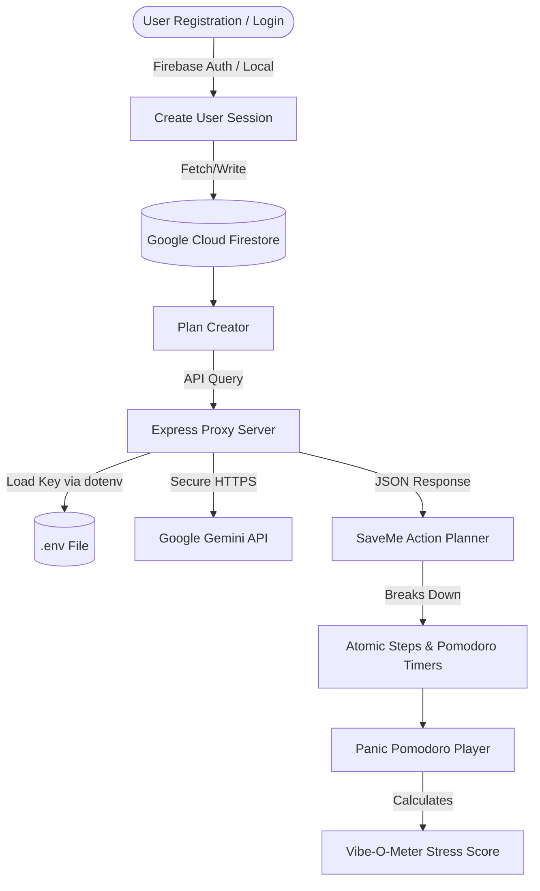

# Vibe2Ship 🚀 — The Last-Minute AI Life Saver

> **Google Technologies Used:** Google Gemini 2.5 Flash API, Google Firebase Authentication (Email/Password), Google Cloud Firestore
> 
> **Evaluation Ports:** Dev Server: [http://localhost:5173](http://localhost:5173) | Production Server: [http://localhost:3001](http://localhost:3001)

---

## 💡 Overview
Traditional calendars and productivity lists rely on **passive notifications** (e.g., *"Essay due in 2 hours"*). These notifications are easy to dismiss, increase deadline anxiety, and offer zero guidance on how to get started when feeling overwhelmed.

**Vibe2Ship** is an active, agentic workspace designed for students, entrepreneurs, and developers facing deadline panic. Powered by **Google Gemini**, the app breaks down complex tasks into atomic micro-steps, visualizes a timeline from the current moment to the final minute, and implements active recovery options (like triaging scope or drafting extensions) when a user gets stuck.

---

## 🎨 Core Productivity Features

### 1. The Vibe-O-Meter (Active Urgency Calculator)
Tracks your live urgency state based on remaining time vs remaining work effort:
$$\text{Stress Score} = \min\left(100, \frac{\text{Effort Remaining (hours)}}{\text{Time Left Until Deadline (hours)}} \times 100\right)$$
The interface dynamically transitions through 4 themed states:
*   🟢 **Chill (0–25%):** Emerald calm theme.
*   🔵 **Focused (26–55%):** Cobalt productive flow state.
*   🟡 **Pressured (56–85%):** Amber warning theme. Focus is required.
*   🔴 **Danger Zone (86–100%+):** Pulse-glowing rose danger theme. Action needed.

### 2. SaveMe AI Action Planner
Users input a deadline task, category, and date/time. The Gemini model parses details to generate:
*   **Atomic Steps**: Focused, manageable subtasks (30–60 mins each).
*   **Execution Prompts**: Ready-to-copy prompts to draft, research, or outline each step.
*   **Boilerplate Snippets**: Outline structures or starter guidelines.

### 3. Active Focus Player (Pomodoro)
Locks focus into one micro-step at a time with a ticking countdown. Once a step is complete, a synthesized audio chime sounds, prompting the user to check off the item and advance.

### 4. Recovery Strategy Panel
For users running out of time, Vibe2Ship offers two AI-guided recovery pathways:
*   **Cut Scope (Triage)**: Compresses remaining subtask durations by 30% automatically to adjust the timeline.
*   **Ask Extension**: Generates a polite, context-aware email requesting an extension based on current subtask progress.

---

## 🛠️ System Architecture



---

## 🔒 Security & Data Stacking Contexts
1.  **Backend Proxy Routing**: The client browser never communicates directly with the Google Gemini API. Instead, requests hit relative routes (`/api/plan`, `/api/chat`), and the Node.js Express server injects the private `GEMINI_API_KEY` from the environment.
2.  **Firestore Security Rules**: Configured in `firestore.rules` to enforce document-level boundaries:
    *   `allow read, delete`: Permitted only if the authenticated user (`request.auth.uid`) matches the document owner (`resource.data.userId`).
    *   `allow create, update`: Checks that the task owner's ID matches the active session UID.
3.  **Dropdown & Overlay Z-Index Layouts**: UI elements (like the Category Dropdown and Delete Confirmation Dialogs) use elevated z-index stack values to ensure proper layering over underlying elements.
4.  **Local storage Fallbacks**: If Firebase is not configured, the app runs in **Local Demo Mode** (generating local activation PINs and storing tasks in user-prefixed namespaces like `v2s_tasks_{email}`), ensuring immediate out-of-the-box evaluations.

---

## 🚀 Installation & Running the App

### Step 1: Set up Environment Keys (`.env`)
Create a `.env` file at the root of the project (template provided in `.env.local` or `.env` template):
```env
# Server Port
PORT=3001

# Secure Gemini API Key
GEMINI_API_KEY=AIzaSy...

# Google Firebase Client Credentials
VITE_FIREBASE_API_KEY=AIzaSyA1...
VITE_FIREBASE_AUTH_DOMAIN=vibe2ship-xxxx.firebaseapp.com
VITE_FIREBASE_PROJECT_ID=vibe2ship-xxxx
VITE_FIREBASE_STORAGE_BUCKET=vibe2ship-xxxx.appspot.com
VITE_FIREBASE_MESSAGING_SENDER_ID=8471...
VITE_FIREBASE_APP_ID=1:8471...
```
*Note: If Firebase variables are left blank, the app runs in local offline simulation mode.*

### Step 2: Deploy Database Security Rules
To push your secure rules configurations to your Firebase console project, run:
```bash
npx firebase-tools login
npx firebase-tools deploy --only firestore:rules
```

### Step 3: Run Development Server
To launch both the Node.js backend proxy and the Vite development server in parallel, run:
```bash
npm run dev
```
*Access interface:* [http://localhost:5173](http://localhost:5173)

### Step 4: Run Production Build
To compile the static React assets and serve them directly from the Express server, run:
```bash
# Compile client app
npm run build

# Start production server
npm start
```
*Access interface:* [http://localhost:3001](http://localhost:3001)

---

## 📂 Project Directory Structure

```text
├── dist/                   # Compiled static production bundle
├── public/                 # Static assets (fonts, icons, templates)
├── src/
│   ├── App.jsx             # Main workspace UI & React engine
│   ├── firebase.js         # Firebase Auth, Firestore configurations, and local fallbacks
│   ├── gemini.js           # Gemini API secure endpoints & structured prompts
│   ├── index.css           # Custom glassmorphic styling, animations, and layouts
│   └── main.jsx            # React root mount anchor
├── .env                    # Private environment credentials (Gemini, Firebase)
├── firebase.json           # Firebase CLI deploy configs
├── firestore.rules         # Secure database documents access policy rules
├── server.js               # Node.js backend proxy & SPA static server
├── package.json            # Node project metadata and scripts
└── README.md               # Documentation guide
```
